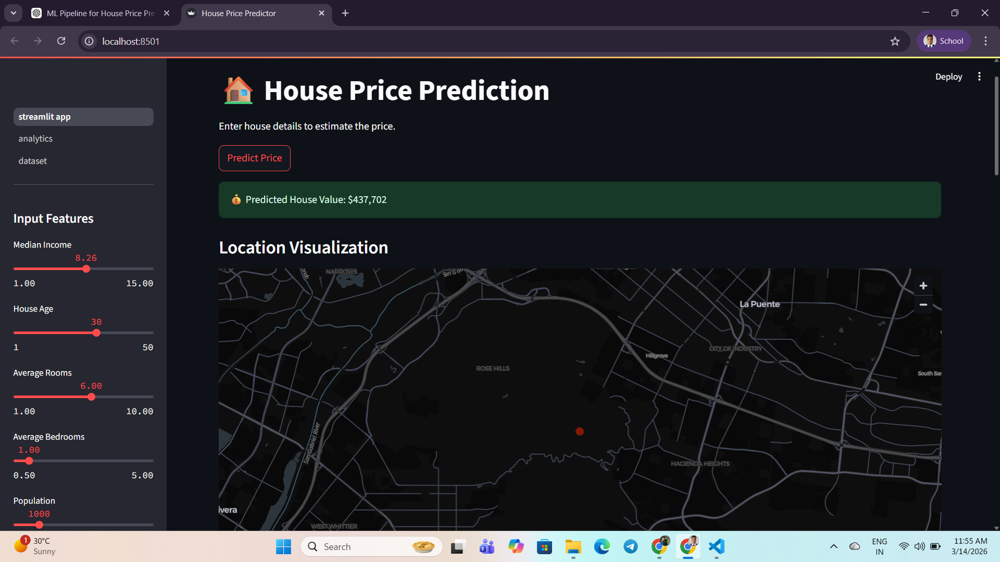
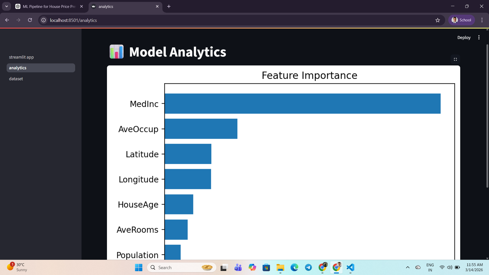
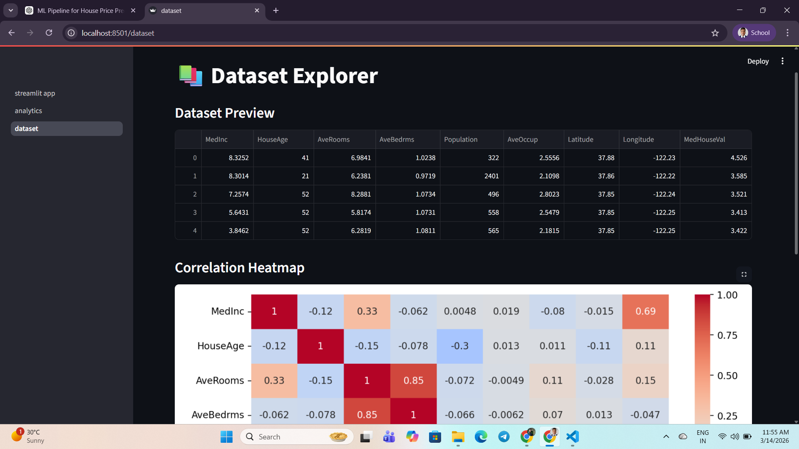
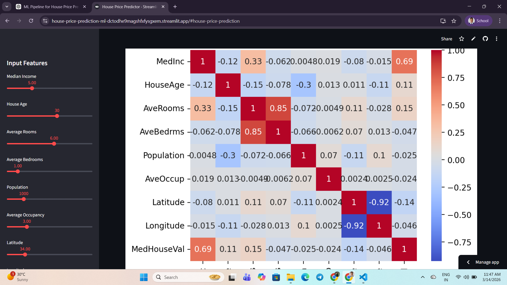

# 🏠 House Price Prediction (Warm-up ML Project)


## Objective
Build a regression model to predict median house values using the California Housing dataset.

## Model
Random Forest Regressor

## Tech Stack

- Python
- Scikit-learn
- Pandas
- NumPy
- Matplotlib
- Seaborn
- Streamlit

## Features
• Real-time house price prediction  
• Feature importance visualization  
• Interactive location map  
• Model performance metrics  
• Dataset exploration dashboard  
• Multi-page Streamlit interface  

## Live Demo

https://house-price-prediction-ml-dctodhe9magshfxfysgxem.streamlit.app/

---

## App Preview

### Prediction Dashboard


### Model Analytics


### Dataset Explorer


### Heatmap


## Project Structure

```
house-price-prediction
│
├ app
│   ├ streamlit_app.py
│   └ pages
│       ├ analytics.py
│       └ dataset.py
│
├ model
│   └ house_price_model.pkl
│
├ src
│   └ train_model.py
│
├ requirements.txt
└ README.md
```

## Steps Performed
- Loaded dataset using sklearn
- Performed feature-target separation
- Train-test split (80/20)
- Applied Linear Regression
- Applied Random Forest Regressor
- Evaluated using MSE and R²

## Results

| Model | R² Score |
|-------|----------|
| Linear Regression | 0.57 |
| Random Forest | 0.80 |


## ▶️ Run the project locally

### 1️⃣ Install dependencies
```
pip install -r requirements.txt
```
### 2️⃣ Train the model
```
python src/train_model.py
```
### 3️⃣ Run the Streamlit app
```
streamlit run app/streamlit_app.py
```

## Author

Aniket Saha    
Machine Learning Enthusiast